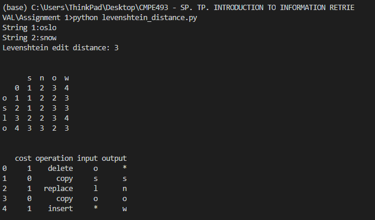
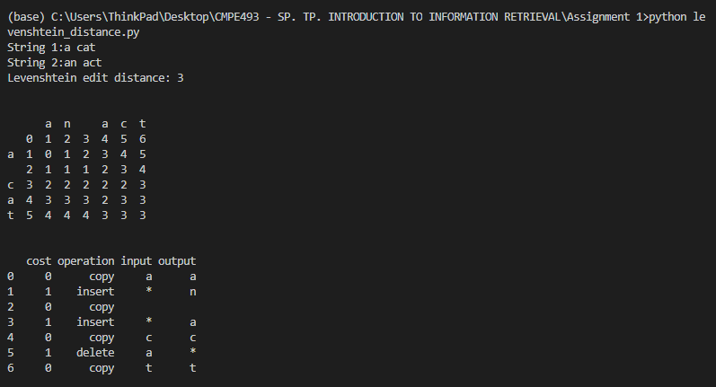
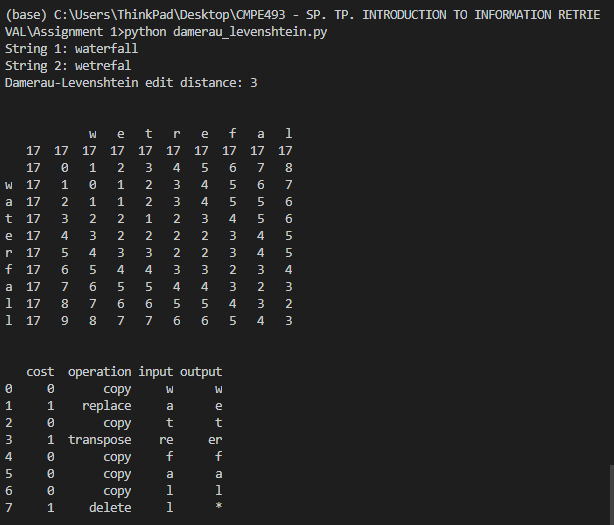
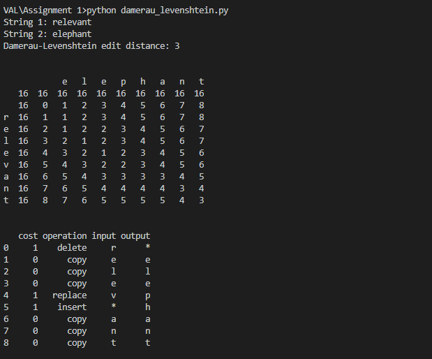
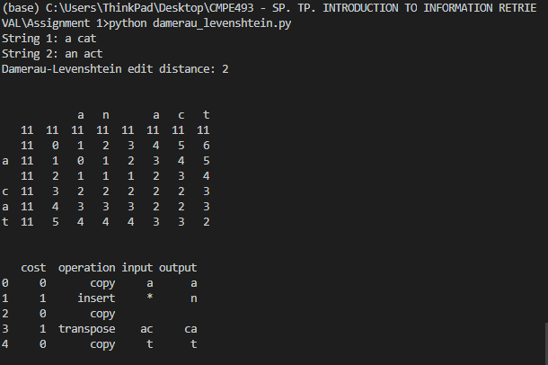

## Levenshtein Distance

Levenshtein Distance is a between two strings is calculated by a minimal amount of operations which are:

- Deletion
- Insertion
- Substitution

First create a empty matrix using numpy library with the size of M(length of string_1 + 1, length of string_2 + 1)

````python
import numpy as np
table = np.zeros((len(string_1)+1, len(string_2)+1),dtype=int)
````

- table[] --> corresponding edit table

Then fill the first row with the cost of insertion given an empty string "" --> string_2 and the cost of deletion to string_1 --> ""

````python
for i in range(len(string_1)+1):
    table[i,0] = i

for j in range(len(string_2)+1):
    table[0,j] = j
````

Then start a loop to assign edit values of each cell using edit distance algorithm with 3 operation

````python
    rc = 1
       
    if string_1[i-1] == string_2[j-1]:
        rc = 0
    table[i,j] = min(table[i-1,j]+1,    # deletion
                     table[i,j-1]+1,    # insertion
                     table[i-1,j-1]+rc  # substitution
                     )
````

- In the loop the cost of substitution is default = 1

Get the Levenshtein distance by getting the last cell from edit table

Then created a data frame with pandas library

`````python
import pandas as pd

levenshtein_matrix = pd.DataFrame(data=table, index=indexes, columns=column, dtype=int)

`````

Before back tracing operation, create a operation list to store the sequence of operations in the form of

````python
["cost","operation","input","output"]
````

Back tracing loop starts from the last cell

`````python
i = len(string_1)+1
j = len(string_2)+1

while True:
	current_cell = table[i,j]
`````

For each operation:

1. Deletion

````python
if current_cell == table[i-1,j]+1:

    	i -= 1
        operation_column.append([1, "delete", string_1[i], "*"])

        continue

````

2. Insertion

````python
elif current_cell == table[i,j-1]+1:
       
        j -= 1
        operation_column.append([1, "insert", "*", string_2[j]])
        
        continue
````

3. Copy

````python
  elif current_cell == table[i-1,j-1]:

        i -= 1
        j -= 1
        operation_column.append([0, "copy", string_1[i], string_2[j]])

        continue
````

4. Replace

`````python
  elif current_cell == table[i-1,j-1]+1:

        i -= 1
        j -= 1
        operation_column.append([1, "replace", string_1[i], string_2[j]])

        continue
`````

Since the operations start from end of the strings, reverse the list

Then create a table for operations

````python
operation_df = pd.DataFrame(data=operation_column, index=None, columns=["cost","operation","input","output"])
````

## Screenshots







## Damerau-Levenshtein Distance

Damerau-Levenshtein Distance differs from Levenshtein distance with an additional string operation which is transposition. The operation includes changing the order of the adjacent characters. "Optimal string alignment distance algorithm" is used for calculating the transposition cost. Besides the changes below the code works same as the levenshtein_distance.py file.


The matrix has an additional layer with a max_distance value of sum of two strings, The reason behind is that prevent transposing of an empty string and the first character. 

This results with a matrix with the size of M(length of string_1 + 2, length of string_2 + 2)

 ````python
table = np.zeros((len(string_1)+2, len(string_2)+2),dtype=int)
 ````


If the adjacent two character of string_1 are the same with adjacent two character of string_2 in reverse order, calculate the minimum of transposition cost and minimum of 3 operations

`````python
table[i,j] = min(table[i-1,j]+1,    # deletion
                 table[i,j-1]+1,    # insertion
                 table[i-1,j-1]+rc  # replacement/copy
                         )
        
        # Transposition condition 
if string_1[i-2] == string_2[j-3] and string_1[i-3] == string_2[j-2]:
            table[i,j] = min(table[i,j], table[i-2,j-2] + rc)
`````

Back tracing process should start with the transposition condition since the surrounding cell can have the same value

````python
while True:
    
    current_cell = table[i,j]

    #Transposition
    if current_cell == table[i-2,j-2] + 1 and string_1[i-2] == string_2[j-3] and string_1[i-3] == string_2[j-2]:

        i -= 2
        j -= 2
        operation_column.append([1, "transpose", string_1[i]+string_1[i-1], string_1[i-1]+string_1[i]])

        continue

````








When you consider string "a cat" and string "an act" has Levenshtein distance of 3, the Damerau-Levenshtein distance of the same set of strings is 2 
